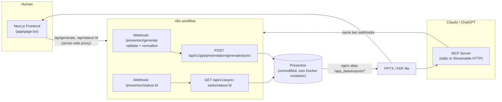

# Presenton Automation Suite

A frontend + n8n workflow + MCP server that generate real, downloadable presentations by
orchestrating a self-hosted [Presenton](https://github.com/presenton/presenton) instance —
built as a developer assessment on understanding an existing system and turning it into a
usable product without duplicating what already exists.

## What this is

Presenton is already a complete, open-source AI presentation generator with its own REST API
(outline generation → layout selection → slide rendering → PPTX/PDF export) and its own
async job model (`POST .../generate/async` → poll `GET .../async-tasks/status/{id}`). Rebuilding
that pipeline would be pure not-invented-here waste, so this project does not touch it.

Instead it adds two consumer-facing surfaces that both drive **one** n8n workflow, which in turn
drives Presenton's existing API:

1. A small Next.js frontend for a human to type a topic and download a deck.
2. An MCP server so Claude or ChatGPT can generate a deck as a tool call.



Both the frontend and the MCP server call the **same** n8n webhooks — there is exactly one
generation pipeline, not two independent implementations wearing different clothes.

## Repository layout

```
presentation-automation-suite/
├── docker-compose.yml              # this project's own isolated n8n instance
├── .env.example                    # root env (n8n port, Presenton base URL)
├── n8n/
│   └── presenton-generation-workflow.json
├── frontend/                       # Next.js App Router + Tailwind
│   ├── app/page.tsx                # the generation form + polling UI
│   ├── app/api/generate/route.ts   # server-side proxy -> n8n "start" webhook
│   └── app/api/status/[id]/route.ts# server-side proxy -> n8n "status" webhook
└── mcp-server/                     # Node/TypeScript MCP server
    ├── src/server.ts               # tool definitions (shared by both transports)
    ├── src/stdio.ts                # entry point for Claude Desktop / Claude Code
    ├── src/http.ts                 # entry point for remote clients (e.g. ChatGPT)
    └── src/presentonClient.ts      # calls the n8n webhooks, polls to completion
```

Presenton itself is **not** vendored into this repo — clone it separately and run its own
Docker Compose, as documented below.

## Prerequisites

- Docker Desktop (for Presenton and for this project's n8n instance)
- Node.js ≥ 20 and npm (for the frontend and the MCP server)
- An API key for an LLM provider Presenton supports (OpenAI, Anthropic, Google, Ollama, etc.)
- A separate local clone of [presenton/presenton](https://github.com/presenton/presenton)

## Setup

### 1. Run Presenton (the generation engine, unmodified)

In your separate clone of `presenton/presenton`:

```bash
# presenton/.env  (this file is gitignored by Presenton's own .gitignore)
LLM=openai
OPENAI_API_KEY=sk-...
OPENAI_MODEL=gpt-4o-mini          # or any model your account supports
PRESENTATION_GENERATION_MODE=standard
```

```bash
docker compose up -d --build production
```

Presenton is now on `http://localhost:5001`. Confirm it's healthy:

```bash
curl http://localhost:5001/api/v1/ppt/template/all
```

> **Windows/Docker Desktop note:** if the build fails with `frontend grpc server closed
> unexpectedly` or buildx workers report `DeadlineExceeded`, Docker Desktop's BuildKit
> backend hasn't finished stabilizing after a fresh start. Fix: `docker buildx inspect
> --bootstrap desktop-linux`, then re-run the build.

### 2. Run this project's n8n and import the workflow

```bash
cd presentation-automation-suite
cp .env.example .env
docker compose up -d
```

This starts n8n on **`http://localhost:5679`** (deliberately not the 5678 default, so it
never collides with another n8n instance you might already have running). Open the UI, sign
in (first run asks you to create a local owner account), then:

1. **Import from File** → select `n8n/presenton-generation-workflow.json`.
2. Open the workflow and toggle it **Active** (top right) — webhooks only serve production
   traffic while the workflow is active.
3. That's it — no credentials to configure. The HTTP Request nodes reach Presenton via the
   `PRESENTON_BASE_URL` environment variable (set in the root `.env`, defaults to
   `http://host.docker.internal:5001`, which is how a container reaches a port published on
   the Docker host on Windows/Mac).

The workflow exposes two webhooks:

| Method | Path | Purpose |
|---|---|---|
| `POST` | `/webhook/presenton/generate` | Validates input, starts a Presenton generation job, returns `task_id` |
| `GET` | `/webhook/presenton/status/:id` | Proxies Presenton's async task status, shapes it into `{status, download_url, edit_url, ...}` |

### 3. Run the frontend

```bash
cd frontend
npm install
cp .env.local.example .env.local
npm run dev
```

Open `http://localhost:3000`, fill in a topic, hit **Generate presentation**, watch it poll,
download the PPTX/PDF when it's done.

### 4. Run the MCP server

```bash
cd mcp-server
npm install
cp .env.example .env
```

**For Claude Desktop** — add to `claude_desktop_config.json`:

```json
{
  "mcpServers": {
    "presenton-generator": {
      "command": "npx",
      "args": ["tsx", "/absolute/path/to/presentation-automation-suite/mcp-server/src/stdio.ts"],
      "env": { "N8N_BASE_URL": "http://localhost:5679" }
    }
  }
}
```

**For Claude Code** (run from `mcp-server/`):

```bash
claude mcp add presenton-generator -- npx tsx src/stdio.ts
```

**For ChatGPT / any remote MCP client** — run the Streamable HTTP transport and tunnel it:

```bash
npm run start:http                              # listens on http://127.0.0.1:8787/mcp
ngrok http 8787 --host-header=rewrite           # preserves the Host header the server checks
```

Point ChatGPT's custom connector (Developer Mode) at the `https://<...>.ngrok.app/mcp` URL.
`--host-header=rewrite` matters: the server validates the `Host` header against localhost to
block DNS-rebinding attacks, so the tunnel must present it unchanged.

Both transports register the same two tools, from the same code:

- `generate_presentation(content, n_slides?, language?, tone?, verbosity?, template?, export_as?, wait_for_completion?)`
  — starts a job; by default blocks (polling every 5s, up to 5 min) and returns the download URL.
- `check_presentation_status(task_id)` — for the `wait_for_completion: false` path, or to
  resume checking a long-running job.

## Configuration reference

| File | Variable | Meaning |
|---|---|---|
| `presenton/.env` (in the Presenton clone) | `OPENAI_API_KEY` / `ANTHROPIC_API_KEY` / etc. | LLM provider credentials — see Presenton's own README for the full list |
| `presenton/.env` | `PRESENTATION_GENERATION_MODE` | `standard`, `smart`, or `both` — this project uses `standard` |
| `presentation-automation-suite/.env` | `N8N_HOST_PORT` | Host port for n8n (default `5679`) |
| `presentation-automation-suite/.env` | `PRESENTON_BASE_URL` | How n8n reaches Presenton (default `http://host.docker.internal:5001`) |
| `frontend/.env.local` | `N8N_BASE_URL` | How the Next.js API routes reach n8n (default `http://localhost:5679`) |
| `mcp-server/.env` | `N8N_BASE_URL`, `N8N_GENERATE_PATH`, `N8N_STATUS_PATH_PREFIX` | How the MCP server reaches the n8n webhooks |
| `mcp-server/.env` | `POLL_INTERVAL_MS`, `MAX_WAIT_MS` | Polling cadence and timeout for `wait_for_completion: true` |
| `mcp-server/.env` | `PORT` | Port for the Streamable HTTP transport only |

Never commit real API keys. Every `.env` above has a matching `.env.example` / `.env.local.example`.

## Testing performed

- **MCP tool discovery** — verified for real with the official inspector: `npx
  @modelcontextprotocol/inspector --cli npx tsx src/stdio.ts --method tools/list` returns
  both tools with correctly-derived JSON Schemas (`content` required, enums for `tone`/
  `verbosity`/`export_as`, etc.).
- **Frontend production build** — `npm run build` compiles cleanly (Next.js 16 + Turbopack,
  TypeScript strict) and produces the expected route map: `/`, `/api/generate`,
  `/api/status/[id]`.
- **n8n workflow** — every node type/version in the JSON (`webhook@2.1`, `httpRequest@4.5`,
  `code@2`, `set@3.5`, `respondToWebhook@1.5`) was cross-checked against n8n's current source
  to make sure the file imports cleanly on a current n8n install.
- **End-to-end generation** — see the note below.

<!-- END_TO_END_RESULT_PLACEHOLDER -->

## Architecture decisions and trade-offs

**Reused, not rebuilt:** Presenton's outline generation, layout matching, slide rendering,
and PPTX/PDF export (a genuinely large pipeline involving multiple LLM calls and a
Puppeteer-based renderer) are used through its existing REST API unmodified. Nothing about
that pipeline is duplicated here.

**Why the standard (not smart) generation mode:** Presenton ships two generation modes.
*Standard* is layout/template-based and produces a fully editable, re-templatable deck with
a slide-by-slide async progress model — the closer match to "the core slide-generation
workflow" the assessment describes, and it demonstrates template selection, which *smart*
mode doesn't expose. *Smart* mode (freeform HTML slides) is a reasonable alternative Presenton
also supports; switching the n8n workflow's HTTP Request node to
`/api/v2/ppt/presentation/generate/smart/async` is a one-node change if that's ever preferred.

**Why n8n has two small webhook lanes instead of one big synchronous flow:** generation
takes anywhere from ~30 seconds to several minutes. A webhook that blocks that long is
fragile (client timeouts, n8n's own webhook response timeout). Splitting into a start lane
(returns a `task_id` immediately) and a status lane (cheap, pollable) mirrors exactly how
Presenton's own API is already async — the workflow's shape follows the shape of the system
it's automating, rather than fighting it.

**Why a new MCP server instead of reusing Presenton's built-in one:** Presenton already ships
an MCP server (`mcp_server.py`) that wraps its OpenAPI spec directly. Pointing at that would
have satisfied the letter of "build an MCP server" with almost no engineering. Building a
thin MCP server that calls the **same n8n workflow** the frontend uses instead means both
consumer surfaces (human UI, AI tool call) share one orchestration path — there's one place
that defines "how a presentation gets generated," not two.

**MCP SDK choice:** built on `@modelcontextprotocol/server` (v2), the current officially
documented TypeScript SDK as of this writing — `@modelcontextprotocol/sdk` (v1) is now the
legacy package. Both transports (`stdio` for Claude Desktop/Code, Streamable HTTP for remote
clients like ChatGPT) are built from the same `createServer()` factory in `src/server.ts`, so
there's exactly one tool implementation, not one per transport.

**What's deliberately not here:**
- No auth on the n8n webhooks or the Next.js proxy routes. Correct for a local assessment
  demo; the first thing to add before exposing this beyond localhost/a tunnel.
- No job queue or de-duplication — one job in flight is assumed. A real multi-user deployment
  would want a queue (e.g. BullMQ) and idempotency keys.
- No shadcn/ui — a single-page form didn't need a component library; Tailwind directly was
  faster and just as clean. Would reach for one if the UI grew past a page or two.
- No database in the frontend or MCP server. Job state lives entirely in Presenton's own
  store via its `AsyncTaskModel` — there's no reason to duplicate that.

## Demo script (for the Loom)

1. Show this README's architecture diagram — 20 seconds on "two consumers, one workflow."
2. Frontend: type a topic ("Create a 6-slide presentation on the impact of AI agents on
   modern business operations"), hit Generate, show the polling state, download the PPTX,
   open it.
3. n8n: show the workflow canvas, click into a past execution to show the actual
   request/response against Presenton.
4. MCP: run the same prompt from Claude Desktop/Code (or the MCP Inspector), show
   `generate_presentation` being called and the resulting download link.
5. Close on the trade-offs section above — 30 seconds on what was reused vs. built.
