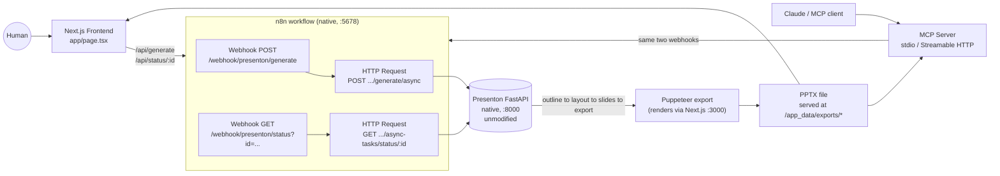

# Presenton Automation Suite

A Next.js frontend, an n8n workflow, and an MCP server that orchestrate a self-hosted
[Presenton](https://github.com/presenton/presenton) instance to generate real, downloadable
presentations. This was built as a developer assessment on understanding an existing
generation system and turning it into a usable product without duplicating what already exists.

This README describes what was actually built and verified, including problems found along the
way and how they were fixed. Claims below are limited to what has concrete evidence behind them.

**Demo video:** [Watch the walkthrough on Loom](https://www.loom.com/share/37e2a11f64354800996f02f027d2c11e)

## What this is

Presenton is already a complete, open-source AI presentation generator with its own REST API
(outline generation, layout selection, slide rendering, PPTX/PDF export) and its own async job
model (`POST .../generate/async` then poll `GET .../async-tasks/status/{id}`). This project does
not touch that pipeline; Presenton runs unmodified.

Two consumer-facing surfaces sit in front of it, both driving the **same** n8n workflow:

1. A small Next.js frontend for a human to type a topic and download a deck.
2. An MCP server so Claude (or any MCP client) can generate a deck as a tool call.



Both the frontend and the MCP server call the same n8n webhooks, so there is one generation
pipeline, not two separate implementations.

## Why this architecture

Presenton's own generation engine (multiple LLM calls for outline/layout/content, a
Puppeteer-based HTML-to-PPTX renderer, asset fetching) is substantial on its own. The goal here
is to understand and orchestrate that system, not re-implement it. This project's own code is
deliberately thin: an n8n workflow that validates input, calls Presenton's existing async API,
and reshapes its response, plus two consumer surfaces that call that workflow. Everything that
actually generates a slide happens inside Presenton, untouched.

## Runtime: native, not Docker

Presenton, n8n, the frontend, and the MCP server run as plain local processes, with no Docker and
no WSL. This was a deliberate change partway through development:

- Docker Desktop's WSL2 VM plus a Presenton image build (Chromium, Python, and Node in one
  multi-stage build) was unreliable on the development machine, including a reproducible
  BuildKit failure (`frontend grpc server closed unexpectedly`).
- Presenton's FastAPI backend doesn't require Docker. It's plain Python/Uvicorn and mounts
  `/app_data` and `/static` directly, which is all this project's n8n workflow, frontend, and MCP
  server need for the generate, status, and download path. Its Next.js server is only needed for
  one step: the PPTX/PDF export renders each slide's HTML by pointing a headless browser at
  Presenton's own `/pdf-maker` page, so that server has to run too, even though nothing else in
  this project talks to it directly.
- n8n runs the same way via `npx n8n start`, which is a local Node process once you look past the
  Docker image it's normally shipped in.

A Docker-based setup (using Presenton's own `docker-compose.yml` from its own repo) should still
work on a machine with more headroom; it just isn't the path built or verified here.

## Repository layout

```text
presentation-automation-suite/
├── .env.example                    # OPENROUTER_API_KEY, consumed by Presenton's startup
├── n8n/
│   ├── presenton-generation-workflow.json
│   └── run_native.sh               # launches n8n natively with the right env vars
├── frontend/                       # Next.js App Router + Tailwind
│   ├── app/page.tsx                # the generation form + polling UI
│   ├── app/api/generate/route.ts   # proxy -> n8n "start" webhook (or Presenton directly)
│   ├── app/api/status/[id]/route.ts# proxy -> n8n "status" webhook (or Presenton directly)
│   └── lib/presentonDirect.ts      # direct-to-Presenton adapter, see "Two backend modes"
└── mcp-server/                     # Node/TypeScript MCP server
    ├── src/server.ts               # tool definitions (shared by both transports)
    ├── src/stdio.ts                # entry point for Claude Desktop / Claude Code
    ├── src/http.ts                 # entry point for remote clients
    └── src/presentonClient.ts      # calls the n8n webhooks, polls to completion
```

Presenton itself is not vendored into this repo. Clone it separately, as documented below.

## Prerequisites

- This was built and verified on Windows; the native run steps below should translate to
  macOS/Linux but weren't tested there.
- Python 3.11 (the setup below uses [`uv`](https://docs.astral.sh/uv/) to install and manage this
  without touching system Python).
- Node.js 20 or newer, and npm.
- A Chromium/Chrome binary (Puppeteer fetches its own on first `npm install` in Presenton's
  export tool directory, so no separate install is needed on a normal machine).
- An API key for an LLM provider Presenton supports. This project was built and verified against
  **OpenRouter with Claude Sonnet 5**; Presenton also supports OpenAI, Anthropic, Google, Ollama,
  and others directly, see Presenton's own docs for the full list.
- A separate local clone of [presenton/presenton](https://github.com/presenton/presenton).

## Setup

### 1. Run Presenton natively (the generation engine, unmodified)

In your separate Presenton clone:

```bash
cd presenton/servers/fastapi
uv venv --python 3.11 .venv
uv export --frozen --no-dev --no-emit-project -o /tmp/requirements.txt
uv pip install --python .venv/Scripts/python.exe -r /tmp/requirements.txt
uv pip install --python .venv/Scripts/python.exe --no-deps .
uv pip install --python .venv/Scripts/python.exe \
  "https://github.com/explosion/spacy-models/releases/download/en_core_web_sm-3.8.0/en_core_web_sm-3.8.0-py3-none-any.whl"

cd ../..                          # back to the presenton repo root
node scripts/sync-presentation-export.cjs --force
cd presentation-export && npm install && cd ..
```

Then start the FastAPI backend with these environment variables (export them in your shell, or
put them in a small launcher script):

```bash
APP_DATA_DIRECTORY=<a local folder, e.g. presenton/app_data_native>
LLM=openrouter
OPENROUTER_API_KEY=<your key, see .env.example in this repo>
OPENROUTER_MODEL=anthropic/claude-sonnet-5
PUPPETEER_EXECUTABLE_PATH=<path to chrome.exe from the presentation-export npm install,
  typically under ~/.cache/puppeteer/chrome/.../chrome-win64/chrome.exe>
NEXT_PUBLIC_URL=http://127.0.0.1:3000       # must include the port, see "Bugs found" below
NEXT_PUBLIC_FAST_API=http://127.0.0.1:8000
DISABLE_AUTH=true                            # single-user local mode
DISABLE_IMAGE_GENERATION=true                # keeps generation fast/cheap for local testing
MEM0_ENABLED=false                           # avoids needing a local Ollama for memory features

cd servers/fastapi
.venv/Scripts/python.exe server.py --port 8000 --reload false
```

And, in a second terminal, the Next.js dev server (needed only for the export step's
`/pdf-maker` render target; nothing else in this project talks to this server):

```bash
cd presenton/servers/nextjs
npm install
NEXT_PUBLIC_URL=http://127.0.0.1:3000 \
NEXT_PUBLIC_FAST_API=http://127.0.0.1:8000 \
npx next dev -H 127.0.0.1 -p 3000
```

Confirm both are up:

```bash
curl http://127.0.0.1:8000/api/v1/ppt/template/all   # Presenton's own template list
curl http://127.0.0.1:3000                            # Next.js dev server
```

> If you restart the Next.js dev server after a hard kill and every route starts 404ing
> (including `/`), delete `servers/nextjs/.next-build` and restart. A force-killed dev server can
> leave its incremental build cache in a state where it stops resolving routes.

### 2. Run n8n natively and import the workflow

```bash
cd presentation-automation-suite/n8n
bash run_native.sh
```

`run_native.sh` sets `PRESENTON_BASE_URL=http://127.0.0.1:8000` and
`N8N_BLOCK_ENV_ACCESS_IN_NODE=false`. The second one matters: this n8n version blocks `$env`
access from Code/HTTP-Request expressions by default, and the workflow reads
`$env.PRESENTON_BASE_URL`, so it fails with `"access to env vars denied"` without it.

n8n starts on `http://localhost:5678`. First run asks you to create a local owner account (any
email/password, 8+ characters). Then, in the n8n UI:

1. **Import from File** → select `n8n/presenton-generation-workflow.json`.
2. Open the workflow and toggle it **Active** (top right).

The workflow exposes two webhooks:

| Method | Path | Purpose |
|---|---|---|
| `POST` | `/webhook/presenton/generate` | Validates input, starts a Presenton generation job, returns `task_id` |
| `GET` | `/webhook/presenton/status?id=<task_id>` | Proxies Presenton's async task status, shapes it into `{status, download_url, edit_url, ...}` |

The status webhook takes `id` as a **query parameter**, not a path segment (`/status?id=...`, not
`/status/...`); see "Bugs found and fixed" below for why.

### 3. Run the frontend

```bash
cd frontend
npm install
cp .env.local.example .env.local    # defaults to N8N_BASE_URL=http://localhost:5678
npx next dev -p 3002
```

**Use `-p 3002` (or any port other than 3000), not plain `npm run dev`.** Presenton's own Next.js
dev server from step 1 is already on port 3000. Running this frontend's `next dev` without an
explicit port binds to `0.0.0.0:3000` alongside Presenton's `127.0.0.1:3000`. Next.js prints
"Ready" with no conflict warning, but `http://localhost:3000` then silently routes to Presenton's
own UI instead of this frontend. An explicit non-3000 port avoids the ambiguity.

Open `http://localhost:3002`, fill in a topic, click **Generate presentation**, watch it poll,
download the PPTX when it's done.

### 4. Run the MCP server

```bash
cd mcp-server
npm install
cp .env.example .env    # defaults to N8N_BASE_URL=http://localhost:5678
```

**For Claude Desktop**, add to `claude_desktop_config.json`:

```json
{
  "mcpServers": {
    "presenton-generator": {
      "command": "npx",
      "args": ["tsx", "/absolute/path/to/presentation-automation-suite/mcp-server/src/stdio.ts"],
      "env": { "N8N_BASE_URL": "http://localhost:5678" }
    }
  }
}
```

**For Claude Code** (run from `mcp-server/`):

```bash
claude mcp add presenton-generator -- npx tsx src/stdio.ts
```

**For a remote/HTTP MCP client**, a Streamable HTTP transport exists (`npm run start:http`,
listens on `http://127.0.0.1:8787/mcp`) but has not been exercised against a real remote client
(see Verification below). To reach it from outside localhost you'd need a tunnel that preserves
the `Host` header (e.g. `ngrok http 8787 --host-header=rewrite`), since the server validates
`Host` against localhost to block DNS-rebinding.

Both transports register the same two tools, from the same code:

- `generate_presentation(content, n_slides?, language?, tone?, verbosity?, template?, export_as?, wait_for_completion?)`
  starts a job; by default it blocks (polling every 5s, up to 5 min) and returns the download URL.
- `check_presentation_status(task_id)` is for the `wait_for_completion: false` path, or to resume
  checking a long-running job. Recommended for MCP clients with a short request timeout; see
  Known limitations below.

### 5. Reproduce a full generation

With all four pieces running: open the frontend, enter *"Create a 5-slide presentation
explaining how AI agents improve business operations"*, set slides to 5, click Generate. Expect a
progress message that changes every few seconds ("Generating outlines" then "Generating slides"
then "Fetching assets for slides"), then a download link to a real `.pptx` file, typically after
30 to 90 seconds.

## Configuration reference

| File | Variable | Meaning |
|---|---|---|
| `presentation-automation-suite/.env` (root) | `OPENROUTER_API_KEY` | LLM provider key, sourced by Presenton's startup step |
| Presenton's own env (exported before `python server.py`) | `LLM`, `OPENROUTER_MODEL`, `APP_DATA_DIRECTORY`, `PUPPETEER_EXECUTABLE_PATH`, `NEXT_PUBLIC_URL`, `NEXT_PUBLIC_FAST_API`, `DISABLE_AUTH` | See "Run Presenton natively" above |
| `n8n/run_native.sh` | `PRESENTON_BASE_URL`, `N8N_BLOCK_ENV_ACCESS_IN_NODE` | How n8n reaches Presenton; env-access permission (see above) |
| `frontend/.env.local` | `N8N_BASE_URL` | How the Next.js API routes reach n8n (canonical path) |
| `frontend/.env.local` | `PRESENTON_BASE_URL` (optional) | Bypasses n8n entirely, calls Presenton directly, see `frontend/README.md` |
| `mcp-server/.env` | `N8N_BASE_URL`, `N8N_GENERATE_PATH`, `N8N_STATUS_PATH_PREFIX` | How the MCP server reaches the n8n webhooks |
| `mcp-server/.env` | `POLL_INTERVAL_MS`, `MAX_WAIT_MS` | Polling cadence and timeout for `wait_for_completion: true` |
| `mcp-server/.env` | `PORT` | Port for the Streamable HTTP transport only |

Never commit real API keys. Every `.env` above has a matching `.env.example` /
`.env.local.example`, and `.gitignore` at both the repo root and inside `frontend/` excludes real
env files while keeping the `.example` templates trackable.

## Verification

Everything below was run against the live, native stack described above, not inferred from
reading the code. Generated files were downloaded and validated with Python's `zipfile` module
(confirming `testzip()` is clean and that the requested slide count appears as
`ppt/slides/slideN.xml` entries), not just checked for a `.pptx` extension.

### Verified (with concrete evidence)

- **Presenton generation, direct**: multiple presentations generated via requests straight
  against Presenton's own API (bypassing n8n). Outline, layout, slides, and export all completed,
  producing valid, correctly-sized PPTX files.
- **OpenRouter + Claude Sonnet 5**: successful LLM calls confirmed in Presenton's logs
  (`HTTP Request: POST https://openrouter.ai/api/v1/chat/completions "HTTP/1.1 200 OK"`),
  producing real slide content.
- **n8n workflow execution**: end-to-end runs through the actual webhooks (not just imported and
  inspected). Real execution records appear in n8n's own executions list, a real Presenton
  `task_id` is returned, status polling works, and a real downloadable file lands at the end.
- **n8n failure handling**: missing `content` returns `400` with a clear message; a nonexistent
  `task_id` returns `502` with the real upstream Presenton error surfaced, not a hang or a false
  success.
- **Frontend, browser-driven**: a headless Chromium session (via Puppeteer, not just curl) typed
  into the form fields, clicked Generate, and the UI transitioned from "Starting generation..." to
  "Your presentation is ready" with a working Download link.
- **Frontend through n8n (the canonical path)**: verified separately from the frontend's
  direct-Presenton bypass mode: a real POST to `/api/generate`, real polling of `/api/status/:id`
  through the n8n webhooks, and a real file downloaded and validated.
- **Frontend failure handling**: backend unreachable returns `502` with a clear message;
  malformed JSON body returns `400`, no crash.
- **Frontend production build**: `npm run build` compiles cleanly (Next.js 16 + Turbopack,
  TypeScript strict).
- **MCP tool discovery**: verified with the official inspector
  (`npx @modelcontextprotocol/inspector --cli ... --method tools/list`); both tools listed with
  correctly-derived JSON Schemas.
- **MCP tool invocation**: `generate_presentation` called via the Inspector CLI in both modes,
  `wait_for_completion: false` followed by `check_presentation_status` polling to a completed
  file, and the default blocking mode, which also produced a real file (confirmed by checking
  Presenton's export directory directly, since the Inspector CLI's own client-side timeout is
  shorter than some generations take; see Known limitations).
- **MCP end-to-end via a real client (Claude Desktop)**: `generate_presentation` invoked from a
  live Claude Desktop session against the running stack. This surfaced two real, separate issues
  rather than a silent failure (see Known limitations for both), which is itself evidence the
  server's error handling works as intended: failures were reported clearly (`isError: true`, no
  hang), not swallowed or misreported as success.
- **MCP failure handling**: a call missing the required `content` argument is rejected at schema
  validation before the tool handler runs; a call against an unreachable n8n instance returns
  `isError: true` with a clear message, no hang.
- **Security**: no secret has ever been committed to this repository (checked against full git
  blob history, not just the current tree). One real gap was found and fixed before it became a
  problem: n8n's local runtime data directory, which contains its encryption key, was untracked
  but not yet gitignored.
- **Cold-start reproducibility**: the full setup was re-run from a clean process state, following
  only this README, as a check that nothing depended on leftover local state. This caught one
  real bug (see "Bugs found and fixed" below).

### Implemented but not verified

- **MCP over Streamable HTTP against a real remote client** (e.g. ChatGPT, or any MCP client
  other than the stdio-based Inspector CLI and Claude Desktop/Code). The code path exists and
  shares the same tool implementation as the verified stdio path, but hasn't been exercised
  against a live remote connection or tunnel.
- **PDF export** (`export_as: "pdf"`). Only `pptx` was exercised in testing; the code path is
  identical aside from that one parameter, but it hasn't been run.
- **Presenton's "smart" generation mode** (the HTML-based v2 path). This project uses "standard"
  mode throughout, deliberately (see Architecture decisions below); smart mode was never
  exercised here.
- **Non-Windows setup**. The native run steps above should translate to macOS/Linux, but this
  project was built and verified entirely on Windows.

### Known limitations

- **No auth** on the n8n webhooks or the frontend's API proxy routes. Acceptable for a local
  demo; the first thing to change before exposing any of this beyond localhost or a tunnel.
- **No job queue or concurrency control**: one job in flight at a time is assumed throughout.
- **This n8n version's quirks are pinned into the workflow**: node `typeVersion`s in
  `presenton-generation-workflow.json` (`httpRequest@4.4`, `set@3.4`, etc.) match what
  `npx n8n start` actually installs today. A different n8n release could ship different available
  versions for the same node types, which would need re-checking.
- **The status webhook uses a query parameter, not a path parameter, because of a version-specific
  n8n limitation, not a design choice**: this n8n release's dynamic-webhook matching only supports
  a dynamic path *prefix* (used for its execution-resume feature), not a `:param` elsewhere in the
  path. That's why the status endpoint is `?id=...` instead of `/status/:id`, in three places that
  all had to agree: the n8n workflow, the MCP server's status client, and the frontend's n8n-mode
  status route.
- **MCP's default blocking call can outlast a strict client's own request timeout**, even though
  the underlying job completes correctly server-side. This was observed both with the Inspector
  CLI (a roughly 2-minute generation outlasted its client-side timeout, but the real file still
  appeared in Presenton's export directory seconds later) and with Claude Desktop, whose own
  client-side timeout is around 4 minutes. `wait_for_completion: false` plus polling with
  `check_presentation_status` is the more robust pattern for such clients.
- **The underlying LLM provider (OpenRouter) can reject rapid or overlapping requests** with an
  "in-flight credit budget exhausted" error (HTTP 402). This was observed once, during a live test
  with multiple back-to-back generation attempts, and confirmed from Presenton's own logs as an
  OpenRouter-side rate limit, not an application bug: this project's error handling surfaced it
  correctly rather than hanging or reporting a false success. Avoid firing overlapping generation
  requests against the same OpenRouter account.

## Bugs found and fixed

Found by running the system end-to-end, not by code inspection.

1. **Puppeteer's export step hit `http://127.0.0.1/pdf-maker` with no port.**
   Presenton's export URL builder defaults to a port-less `http://127.0.0.1`, which assumes nginx
   fronts everything on `:80`. That isn't true in a native, non-Docker setup.
   Fix: set `NEXT_PUBLIC_URL=http://127.0.0.1:3000` explicitly.
2. **The export page still failed to load presentation data with the port fixed.**
   The `pdf-maker` page's data fetch runs in the browser (inside Puppeteer), which can only see
   `NEXT_PUBLIC_*` variables baked in at Next.js dev-server start, not server-only env vars.
   Fix: also set `NEXT_PUBLIC_FAST_API=http://127.0.0.1:8000`.
3. **Every route on the Next.js dev server 404'd, including `/`, after a force-kill and restart.**
   Traced to a corrupted incremental build cache (`.next-build`, this app's custom `distDir`).
   Fix: delete `.next-build` and restart. Documented in Setup above.
4. **n8n rejected `$env.PRESENTON_BASE_URL` reads** with `"access to env vars denied"`.
   This n8n release blocks `$env` access from node expressions by default.
   Fix: `N8N_BLOCK_ENV_ACCESS_IN_NODE=false`.
5. **n8n's HTTP Request and Set nodes failed to activate**, with
   `Cannot read properties of undefined (reading 'execute')`.
   Cause: the workflow used `typeVersion`s (`4.5`, `3.5`) that don't exist in the actually
   installed n8n package (only `4.4`/`3.4` do). These had been checked against n8n's GitHub
   development branch rather than the published package.
   Fix: pin `typeVersion` to what's actually installed.
6. **The status webhook (`/status/:id`) could never be reached**, returning "not registered" even
   though its workflow record was correct.
   Cause, confirmed by reading n8n's own `live-webhooks.js`/`webhook.service.js`: this version's
   dynamic-webhook lookup only supports a dynamic path *prefix* (used for execution-resume), not a
   `:param` at another position in the path.
   Fix: switch to a query parameter (`/status?id=...`) in three places that assumed the old path
   shape: the n8n workflow, the MCP server's `presentonClient.ts`, and the frontend's
   `app/api/status/[id]/route.ts`. The third wasn't caught until the frontend was specifically
   re-tested against the real n8n workflow instead of its direct-Presenton bypass mode.
7. **Presenton returns exported files as raw OS filesystem paths** (e.g.
   `C:\...\app_data_native\exports\pptx\deck.pptx`) in native mode, not URLs. This only looks like
   a URL by coincidence in Presenton's own Docker image, where `APP_DATA_DIRECTORY` happens to
   equal the nginx alias path.
   Fix: a small path-to-URL conversion (keep everything from `exports/` onward, prefix with the
   base URL + `/app_data/`), implemented identically in the n8n workflow's status-shaping node and
   the frontend's `presentonDirect.ts` adapter.
8. **`n8n/run_native.sh` hardcoded an absolute path** for `N8N_USER_FOLDER`, tied to one specific
   machine's clone location. Found during a cold-start check with a fresh clone path.
   Fix: derive the path from the script's own location instead.

## Architecture decisions and trade-offs

**Reused, not rebuilt**: Presenton's outline generation, layout matching, slide rendering, and
PPTX/PDF export are used through its existing REST API, unmodified.

**Standard generation mode, not smart**: *Standard* is layout/template-based and produces a fully
editable deck with a slide-by-slide async progress model. That's the closer match to a
slide-generation workflow with visible progress, and it demonstrates template selection, which
*smart* mode doesn't expose.

**Two small n8n webhook lanes instead of one synchronous flow**: generation takes anywhere from
about 30 seconds to a few minutes. Splitting into a start lane (returns a `task_id` immediately)
and a status lane (cheap, pollable) mirrors how Presenton's own API is already async, and avoids
relying on n8n holding a webhook connection open for minutes.

**A new MCP server instead of reusing Presenton's built-in one**: Presenton already ships an MCP
server (`mcp_server.py`) that wraps its OpenAPI spec directly. Pointing at that would technically
satisfy "build an MCP server" with very little engineering. A thin MCP server that calls the same
n8n workflow the frontend uses means both consumer surfaces share one orchestration path instead
of two independent ones.

**MCP SDK choice**: built on `@modelcontextprotocol/server` (v2), the current officially
documented TypeScript SDK. `@modelcontextprotocol/sdk` (v1) is the legacy package. Both transports
(stdio, Streamable HTTP) share one `createServer()` factory, so there's one tool implementation,
not one per transport.

**Native runtime instead of Docker**: covered above under "Runtime": a resource-constrained dev
machine plus a reproducible Docker Desktop BuildKit issue made Docker unreliable during
development, while Presenton's backend has no hard dependency on it.

**What's deliberately not here**: no auth on the n8n webhooks or the Next.js proxy routes; no job
queue or de-duplication; no component library beyond Tailwind (a single-page form didn't need
one); no database in the frontend or MCP server (job state lives entirely in Presenton's own
store).

## License

No license file is included; treat this repository as all-rights-reserved by default unless the
author states otherwise.
