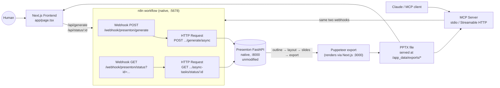

# Presenton Automation Suite

A frontend + n8n workflow + MCP server that orchestrate a self-hosted
[Presenton](https://github.com/presenton/presenton) instance to generate real, downloadable
presentations — built as a developer assessment on understanding an existing system and
turning it into a usable product without duplicating what already exists.

This README describes what was actually built and verified, including the real problems hit
along the way and how they were fixed. It is not aspirational.

## What this is

Presenton is already a complete, open-source AI presentation generator with its own REST API
(outline generation → layout selection → slide rendering → PPTX/PDF export) and its own async
job model (`POST .../generate/async` → poll `GET .../async-tasks/status/{id}`). Rebuilding that
pipeline would be pure not-invented-here waste, so this project does not touch it — Presenton
runs unmodified.

Two consumer-facing surfaces sit in front of it, both driving the **same** n8n workflow:

1. A small Next.js frontend for a human to type a topic and download a deck.
2. An MCP server so Claude (or any MCP client) can generate a deck as a tool call.



Both the frontend and the MCP server call the same n8n webhooks — there is exactly one
generation pipeline, not two independent implementations wearing different clothes.

## Why this architecture

Presenton's own generation engine (multiple LLM calls for outline/layout/content, a
Puppeteer-based HTML-to-PPTX renderer, asset fetching) is genuinely substantial. The
assessment is about understanding that system and orchestrating it, not re-implementing it.
So this project's own code is deliberately thin: an n8n workflow that validates input, calls
Presenton's existing async API, and reshapes its response — plus two consumer surfaces that
call that workflow. Everything that actually generates a slide happens inside Presenton,
untouched.

## Runtime: native, not Docker

Presenton, n8n, the frontend, and the MCP server all run as **plain local processes on
Windows** — no Docker, no WSL. This was a deliberate pivot partway through development, not
the original plan:

- The development machine has 8 GB of RAM. Docker Desktop's WSL2 VM plus a Presenton image
  build (Chromium + Python + Node in one multi-stage build) repeatedly pushed the machine into
  swap, and separately hit a reproducible BuildKit bug (`frontend grpc server closed
  unexpectedly`) that a `wsl --update` only partially fixed.
- Presenton's FastAPI backend doesn't actually require Docker — it's plain Python/Uvicorn, and
  it mounts `/app_data` and `/static` directly (see `api/main.py`), which is all this project's
  n8n workflow / frontend / MCP server need for the generate → status → download path. Next.js
  is only needed for one specific step: the PPTX/PDF export renders each slide's HTML by
  navigating a headless browser to Presenton's Next.js `/pdf-maker` page, so that server has to
  run too, even though nothing else in this project talks to it directly.
- n8n runs the same way, via `npx n8n start` — also just a local Node process once you look
  past the Docker image it's normally shipped in.

Every piece of this project was built and verified against that native setup. A
Docker-based setup (using Presenton's own `docker-compose.yml` in its own repo) would still
work on a machine with more headroom — it just wasn't the path used or tested here, so this
README doesn't document it as if it were.

## Repository layout

```text
presentation-automation-suite/
├── .env.example                    # OPENROUTER_API_KEY, consumed by Presenton's startup
├── n8n/
│   ├── presenton-generation-workflow.json
│   └── run_native.sh               # launches n8n natively with the right env vars
├── frontend/                       # Next.js App Router + Tailwind
│   ├── app/page.tsx                # the generation form + polling UI
│   ├── app/api/generate/route.ts   # proxy -> n8n "start" webhook (or Presenton directly)
│   ├── app/api/status/[id]/route.ts# proxy -> n8n "status" webhook (or Presenton directly)
│   └── lib/presentonDirect.ts      # direct-to-Presenton adapter, see "Two backend modes"
└── mcp-server/                     # Node/TypeScript MCP server
    ├── src/server.ts               # tool definitions (shared by both transports)
    ├── src/stdio.ts                # entry point for Claude Desktop / Claude Code
    ├── src/http.ts                 # entry point for remote clients
    └── src/presentonClient.ts      # calls the n8n webhooks, polls to completion
```

Presenton itself is **not** vendored into this repo — clone it separately, as documented below.

## Prerequisites

- Windows (this was built and verified on Windows; the native run steps below should translate
  to macOS/Linux but weren't tested there)
- Python 3.11 (the setup below uses [`uv`](https://docs.astral.sh/uv/) to install and manage
  this without touching any system Python)
- Node.js ≥ 20 and npm
- A Chromium/Chrome binary (Puppeteer will fetch its own on first `npm install` in the export
  tool's directory — no separate install needed on a normal machine)
- An API key for an LLM provider Presenton supports. **This project was built and verified
  against OpenRouter with Claude Sonnet 5**; Presenton also supports OpenAI, Anthropic, Google,
  Ollama, and others directly — see Presenton's own docs for the full list.
- A separate local clone of [presenton/presenton](https://github.com/presenton/presenton)

## Setup

### 1. Run Presenton natively (the generation engine, unmodified)

In your separate Presenton clone:

```bash
cd presenton/servers/fastapi
uv venv --python 3.11 .venv
uv export --frozen --no-dev --no-emit-project -o /tmp/requirements.txt
uv pip install --python .venv/Scripts/python.exe -r /tmp/requirements.txt
uv pip install --python .venv/Scripts/python.exe --no-deps .
uv pip install --python .venv/Scripts/python.exe \
  "https://github.com/explosion/spacy-models/releases/download/en_core_web_sm-3.8.0/en_core_web_sm-3.8.0-py3-none-any.whl"

cd ../..                          # back to the presenton repo root
node scripts/sync-presentation-export.cjs --force
cd presentation-export && npm install && cd ..
```

Then start the FastAPI backend with these environment variables (put them in a small launcher
script, or export them in your shell):

```bash
APP_DATA_DIRECTORY=<some local folder, e.g. presenton/app_data_native>
LLM=openrouter
OPENROUTER_API_KEY=<from this repo's .env, see below>
OPENROUTER_MODEL=anthropic/claude-sonnet-5
PUPPETEER_EXECUTABLE_PATH=<path to chrome.exe from the presentation-export npm install,
  typically under ~/.cache/puppeteer/chrome/.../chrome-win64/chrome.exe>
NEXT_PUBLIC_URL=http://127.0.0.1:3000       # must include the port -- see "Real bugs" below
NEXT_PUBLIC_FAST_API=http://127.0.0.1:8000
DISABLE_AUTH=true                            # single-user local mode, same one Electron uses
DISABLE_IMAGE_GENERATION=true                # keeps generation fast/cheap for local testing
MEM0_ENABLED=false                           # avoids needing a local Ollama for memory features

cd servers/fastapi
.venv/Scripts/python.exe server.py --port 8000 --reload false
```

And, in a second terminal, the Next.js dev server (only needed for the export step's
`/pdf-maker` render target — nothing else talks to this server):

```bash
cd presenton/servers/nextjs
npm install
NEXT_PUBLIC_URL=http://127.0.0.1:3000 \
NEXT_PUBLIC_FAST_API=http://127.0.0.1:8000 \
npx next dev -H 127.0.0.1 -p 3000
```

Confirm both are up:

```bash
curl http://127.0.0.1:8000/api/v1/ppt/template/all   # Presenton's own template list
curl http://127.0.0.1:3000                            # Next.js dev server
```

> **If you restart the Next.js dev server after a hard kill and every route starts 404ing**
> (including `/`), delete `servers/nextjs/.next-build` and restart — a force-killed dev server
> can leave its incremental build cache in a state where it silently stops resolving routes.
> This happened during development and cost real debugging time before the cause was found.

### 2. Run n8n natively and import the workflow

```bash
cd presentation-automation-suite/n8n
bash run_native.sh
```

`run_native.sh` sets `PRESENTON_BASE_URL=http://127.0.0.1:8000` and
`N8N_BLOCK_ENV_ACCESS_IN_NODE=false` — the second one matters: recent n8n versions block
`$env` access from Code/HTTP-Request expressions by default, and this workflow reads
`$env.PRESENTON_BASE_URL`, so it fails with `"access to env vars denied"` without this.

n8n starts on `http://localhost:5678`. First run asks you to create a local owner account
(any email/password, 8+ characters). Then, in the n8n UI:

1. **Import from File** → select `n8n/presenton-generation-workflow.json`.
2. Open the workflow and toggle it **Active** (top right).

The workflow exposes two webhooks:

| Method | Path | Purpose |
|---|---|---|
| `POST` | `/webhook/presenton/generate` | Validates input, starts a Presenton generation job, returns `task_id` |
| `GET` | `/webhook/presenton/status?id=<task_id>` | Proxies Presenton's async task status, shapes it into `{status, download_url, edit_url, ...}` |

Note the status webhook takes `id` as a **query parameter**, not a path segment
(`/status?id=...`, not `/status/...`) — see "Real bugs found and fixed" below for why.

### 3. Run the frontend

```bash
cd frontend
npm install
cp .env.local.example .env.local    # defaults to N8N_BASE_URL=http://localhost:5678
npx next dev -p 3002
```

**Use `-p 3002` (or any port other than 3000), not plain `npm run dev`.** Presenton's own
Next.js dev server from step 1 is already on port 3000. Running this frontend's `next dev`
without an explicit port binds to `0.0.0.0:3000` alongside Presenton's `127.0.0.1:3000` — Next
js prints "Ready" with **no conflict warning at all**, but `http://localhost:3000` then
silently routes to Presenton's own UI instead of this frontend (confirmed directly: a
`curl localhost:3000/api/generate` returned Presenton's own `{"detail":"Unauthorized"}`, not
this app's route). An explicit non-3000 port sidesteps the ambiguity entirely.

Open `http://localhost:3002`, fill in a topic, hit **Generate presentation**, watch it poll,
download the PPTX when it's done.

### 4. Run the MCP server

```bash
cd mcp-server
npm install
cp .env.example .env    # defaults to N8N_BASE_URL=http://localhost:5678
```

**For Claude Desktop** — add to `claude_desktop_config.json`:

```json
{
  "mcpServers": {
    "presenton-generator": {
      "command": "npx",
      "args": ["tsx", "/absolute/path/to/presentation-automation-suite/mcp-server/src/stdio.ts"],
      "env": { "N8N_BASE_URL": "http://localhost:5678" }
    }
  }
}
```

**For Claude Code** (run from `mcp-server/`):

```bash
claude mcp add presenton-generator -- npx tsx src/stdio.ts
```

**For a remote/HTTP MCP client** — the Streamable HTTP transport exists (`npm run start:http`,
listens on `http://127.0.0.1:8787/mcp`) but has not been tested against a real remote client in
this project (see Verification below). To reach it from outside localhost you'd need a tunnel
that preserves the `Host` header (e.g. `ngrok http 8787 --host-header=rewrite`), since the
server validates `Host` against localhost to block DNS-rebinding.

Both transports register the same two tools, from the same code:

- `generate_presentation(content, n_slides?, language?, tone?, verbosity?, template?, export_as?, wait_for_completion?)`
  — starts a job; by default blocks (polling every 5s, up to 5 min) and returns the download URL.
- `check_presentation_status(task_id)` — for the `wait_for_completion: false` path, or to
  resume checking a long-running job. **Recommended for MCP clients with a short request
  timeout** — see Verification below for why.

### 5. Reproduce a full generation

With all four pieces running: open the frontend, enter *"Create a 5-slide presentation
explaining how AI agents improve business operations"*, set slides to 5, click Generate.
Expect: a progress message that changes every few seconds ("Generating outlines" →
"Generating slides" → "Fetching assets for slides"), then a download link to a real `.pptx`
file, typically after 30–90 seconds.

## Configuration reference

| File | Variable | Meaning |
|---|---|---|
| `presentation-automation-suite/.env` (root) | `OPENROUTER_API_KEY` | LLM provider key, sourced by Presenton's startup step |
| Presenton's own env (exported before `python server.py`) | `LLM`, `OPENROUTER_MODEL`, `APP_DATA_DIRECTORY`, `PUPPETEER_EXECUTABLE_PATH`, `NEXT_PUBLIC_URL`, `NEXT_PUBLIC_FAST_API`, `DISABLE_AUTH` | See "Run Presenton natively" above |
| `n8n/run_native.sh` | `PRESENTON_BASE_URL`, `N8N_BLOCK_ENV_ACCESS_IN_NODE` | How n8n reaches Presenton; env-access permission (see above) |
| `frontend/.env.local` | `N8N_BASE_URL` | How the Next.js API routes reach n8n (canonical path) |
| `frontend/.env.local` | `PRESENTON_BASE_URL` (optional) | Bypasses n8n entirely, calls Presenton directly — see `frontend/README.md` |
| `mcp-server/.env` | `N8N_BASE_URL`, `N8N_GENERATE_PATH`, `N8N_STATUS_PATH_PREFIX` | How the MCP server reaches the n8n webhooks |
| `mcp-server/.env` | `POLL_INTERVAL_MS`, `MAX_WAIT_MS` | Polling cadence and timeout for `wait_for_completion: true` |
| `mcp-server/.env` | `PORT` | Port for the Streamable HTTP transport only |

Never commit real API keys. Every `.env` above has a matching `.env.example` /
`.env.local.example`, and `.gitignore` at both the repo root and inside `frontend/` was audited
to confirm real env files are excluded while the `.example` templates are still trackable.

## Verification

Everything below was actually run against the live, native stack described above — not
inferred from code reading. Real generated files were downloaded and validated with Python's
`zipfile` module (checking `testzip()` is clean and that the exact requested slide count
appears as `ppt/slides/slideN.xml` entries), not just checked for a `.pptx` extension.

### Verified (with concrete evidence)

- **Presenton generation, direct**: multiple real presentations generated via curl straight
  against Presenton's own API (bypassing n8n) — outline → layout → slides → export all
  completing for real, producing valid, correctly-sized PPTX files.
- **OpenRouter + Claude Sonnet 5**: real successful LLM calls confirmed in Presenton's logs
  (`HTTP Request: POST https://openrouter.ai/api/v1/chat/completions "HTTP/1.1 200 OK"`),
  producing real slide content.
- **n8n workflow execution**: real end-to-end run through the actual webhooks (not just
  imported/inspected) — 11 real execution records in n8n's own executions list, a real
  Presenton task_id returned, real status polling, a real downloadable file at the end.
- **n8n failure handling**: missing `content` → `400` with a clear message; a nonexistent
  task_id → `502` with the real upstream Presenton error surfaced (not a hang, not a false
  success).
- **Frontend, browser-driven**: a real headless Chromium session (via Puppeteer, not just curl)
  typed into the actual form fields, clicked the actual Generate button, and observed the
  actual UI state transition from "Starting generation…" to "Your presentation is ready" with
  a working Download link.
- **Frontend through n8n (the canonical path)**: verified separately from the frontend's
  direct-Presenton mode — real POST to `/api/generate`, real polling of `/api/status/:id`
  through the actual n8n webhooks, real file downloaded and validated.
- **Frontend failure handling**: backend unreachable → `502` with a clear message; malformed
  JSON body → `400`, no crash.
- **Frontend production build**: `npm run build` compiles cleanly (Next.js 16 + Turbopack,
  TypeScript strict) after all route changes described in this README.
- **MCP tool discovery**: verified with the official inspector
  (`npx @modelcontextprotocol/inspector --cli ... --method tools/list`) — both tools listed
  with correctly-derived JSON Schemas.
- **MCP tool invocation**: `generate_presentation` called for real via the Inspector CLI (not
  just discovered) in both modes — `wait_for_completion: false` followed by manual
  `check_presentation_status` polling to a real completed file, and the default blocking mode,
  which also produced a real file (confirmed by checking Presenton's export directory directly,
  since the Inspector CLI's own client-side timeout is shorter than this particular
  generation took — see Known limitations).
- **MCP failure handling**: a call missing the required `content` argument is rejected at
  schema validation before the tool handler even runs; a call against an unreachable n8n
  returns `isError: true` with a clear message, no hang.
- **Security**: no secret has ever been committed to this repository (verified via full git
  blob history, not just current tree). One real gap was found and fixed before it became a
  problem — n8n's local runtime data directory (containing its encryption key) was untracked
  but not yet gitignored.

### Implemented but not verified

- **MCP over Streamable HTTP / a real remote client** (e.g. ChatGPT, or any MCP client other
  than the stdio-based Inspector CLI and Claude Desktop/Code). The code path exists and shares
  the same tool implementation as the verified stdio path, but has not actually been exercised
  against a live remote connection or tunnel in this project.
- **PDF export** (`export_as: "pdf"`). Only `pptx` was exercised in every test above; the code
  path is identical aside from that one parameter, but it hasn't been run.
- **Presenton's "smart" generation mode** (the `/api/v2/...` HTML-based path). This project
  uses "standard" mode throughout, deliberately (see the earlier architecture note in this
  file's history) — smart mode was never tested.
- **Non-Windows setup**. The native run steps above should translate to macOS/Linux, but this
  project was built and verified entirely on Windows.

### Known limitations

- **No auth** on the n8n webhooks or the frontend's API proxy routes — acceptable for a local
  assessment demo, the first thing to change before exposing any of this beyond localhost or a
  tunnel.
- **No job queue or concurrency control** — one job in flight is assumed throughout.
- **This exact n8n version's quirks are pinned into the workflow**: node `typeVersion`s in
  `presenton-generation-workflow.json` (`httpRequest@4.4`, `set@3.4`, etc.) match what
  `npx n8n start` actually installs today. A different n8n release could ship different
  available versions for the same node types, which would need re-checking (this happened once
  already during development — the workflow was originally built against version numbers found
  in n8n's development branch, which weren't available in the published package).
- **The status webhook's dynamic-parameter limitation is version-specific, not a design
  choice**: this n8n release's webhook matching only supports a dynamic path *prefix* (its
  execution-resume pattern), not a `:param` elsewhere in a path — confirmed by reading
  `live-webhooks.js`/`webhook.service.js` directly, not guessed. That's why the status
  endpoint is `?id=...` instead of the more RESTful `/status/:id`, in three places that all had
  to agree: the n8n workflow itself, the MCP server's status client, and the frontend's
  n8n-mode status route.
- **MCP's default blocking call can outlast a strict client's own request timeout** even
  though the underlying job completes correctly server-side (observed directly: the Inspector
  CLI reported a client-side timeout on a ~2-minute generation, but the real file still landed
  in Presenton's export directory a few seconds later). `wait_for_completion: false` plus
  `check_presentation_status` polling is the more robust pattern for such clients and was
  verified reliably across many runs.

## Real bugs found and fixed (a record, not a brag)

These were found by actually running the system end-to-end, not by inspection — each one is
here because at some point this project confidently reported a step as "done" and then a real
test proved otherwise:

1. **Puppeteer's export step hit `http://127.0.0.1/pdf-maker` (no port)** — Presenton's export
   URL builder defaults to port-less `http://127.0.0.1` on the assumption that nginx fronts
   everything on `:80`, which isn't true in a native, non-Docker setup. Fixed by setting
   `NEXT_PUBLIC_URL=http://127.0.0.1:3000` explicitly.
2. **The export page failed to load presentation data even with the port fixed** — the
   `pdf-maker` page's data fetch runs in the *browser* (inside Puppeteer), which can only see
   `NEXT_PUBLIC_*` env vars baked in at Next.js dev-server start, not server-only ones. Fixed
   by also setting `NEXT_PUBLIC_FAST_API=http://127.0.0.1:8000`.
3. **Every route on the Next.js dev server started 404ing, including `/`**, after a force-kill
   and restart. Traced to a corrupted incremental build cache (`.next-build`, this app's custom
   `distDir`) — deleting it and restarting fixed it. Documented in the setup steps above so it
   doesn't cost anyone else the same debugging time.
4. **n8n rejected the workflow's `$env.PRESENTON_BASE_URL` reads** with `"access to env vars
   denied"` — this n8n release blocks `$env` access from node expressions by default. Fixed
   with `N8N_BLOCK_ENV_ACCESS_IN_NODE=false`.
5. **n8n's HTTP Request and Set nodes failed to activate** with
   `Cannot read properties of undefined (reading 'execute')` — the workflow used `typeVersion`s
   (`4.5`, `3.5`) that don't exist in the actual installed n8n package (only `4.4`/`3.4` do).
   These version numbers had been checked against n8n's GitHub development branch rather than
   the published package — a real lesson in verifying against what's actually installed, not
   what's in `main`.
6. **The status webhook (`/status/:id`) could never be reached**, returning "not registered"
   even though the DB record for it was correct. Traced directly into n8n's own
   `live-webhooks.js`/`webhook.service.js`: this version's dynamic-webhook lookup only supports
   a dynamic path *prefix* (used for its execution-resume feature), not a `:param` at another
   position in the path. Fixed by switching to a query parameter (`/status?id=...`) — and this
   had to be fixed in three places that all assumed the old path shape: the n8n workflow, the
   MCP server's `presentonClient.ts`, and the frontend's `app/api/status/[id]/route.ts`. The
   third one wasn't caught until the frontend was specifically re-tested against the real n8n
   workflow (as opposed to its direct-Presenton bypass mode) — a concrete example of why
   "verified through one path" isn't the same as "verified."
7. **Presenton returns exported files as raw OS filesystem paths** (e.g.
   `C:\...\app_data_native\exports\pptx\deck.pptx`) in native mode, not URLs — this only looks
   like a URL by coincidence in Presenton's own Docker image, where `APP_DATA_DIRECTORY`
   happens to equal the nginx alias path. Fixed with a small path-to-URL conversion (keep
   everything from `exports/` onward, prefix with the base URL + `/app_data/`), implemented
   identically in the n8n workflow's status-shaping Code node and the frontend's
   `presentonDirect.ts` adapter.
8. **An OpenAI key ran out of credits mid-assessment** (`insufficient_quota`) — a genuine
   external/provider issue, not a code bug. Switched to OpenRouter + Claude Sonnet 5, which is
   what's documented and verified throughout this README.

## Architecture decisions and trade-offs

**Reused, not rebuilt**: Presenton's outline generation, layout matching, slide rendering, and
PPTX/PDF export are used through its existing REST API unmodified.

**Why the standard (not smart) generation mode**: *Standard* is layout/template-based and
produces a fully editable deck with a slide-by-slide async progress model — the closer match to
"the core slide-generation workflow" the assessment describes, and it demonstrates template
selection, which *smart* mode doesn't expose.

**Why n8n has two small webhook lanes instead of one big synchronous flow**: generation takes
anywhere from ~30 seconds to a few minutes. Splitting into a start lane (returns a `task_id`
immediately) and a status lane (cheap, pollable) mirrors how Presenton's own API is already
async, and avoids relying on n8n holding a webhook connection open for minutes.

**Why a new MCP server instead of reusing Presenton's built-in one**: Presenton already ships
an MCP server (`mcp_server.py`) that wraps its OpenAPI spec directly. Pointing at that would
satisfy the letter of "build an MCP server" with almost no engineering. Building a thin MCP
server that calls the **same n8n workflow** the frontend uses instead means both consumer
surfaces share one orchestration path.

**MCP SDK choice**: built on `@modelcontextprotocol/server` (v2), the current officially
documented TypeScript SDK — `@modelcontextprotocol/sdk` (v1) is now the legacy package. Both
transports share one `createServer()` factory, so there's one tool implementation, not one per
transport.

**Why native instead of Docker**: covered above under "Runtime" — a resource-constrained dev
machine plus a reproducible Docker Desktop BuildKit bug made Docker actively unreliable, while
Presenton's backend has no real dependency on it.

**What's deliberately not here**: no auth on the n8n webhooks or the Next.js proxy routes; no
job queue or de-duplication; no shadcn/ui (a single-page form didn't need a component library);
no database in the frontend or MCP server (job state lives entirely in Presenton's own store).

## Demo script (for the Loom)

1. Show the architecture diagram — 20 seconds on "two consumers, one workflow, Presenton
   untouched."
2. Frontend: enter "Create a 5-slide presentation explaining how AI agents improve business
   operations," hit Generate, show the polling state, download the PPTX, open it.
3. n8n: show the workflow canvas, click into a past execution to show the real request/response
   against Presenton.
4. MCP: run the same prompt from Claude Desktop/Code, show `generate_presentation` being called
   and the resulting download link.
5. Close on one or two items from "Real bugs found and fixed" — it's better evidence of
   understanding the system than a clean happy-path demo alone.
